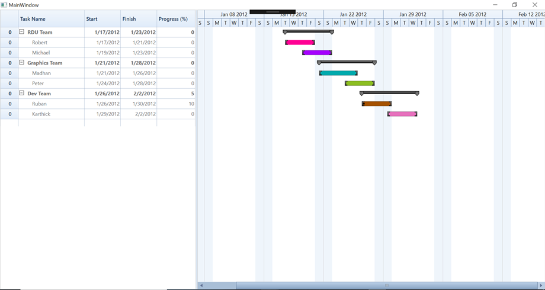

# How to customize the background color of the task node in each row of Gantt WPF

This article explains how to customize the background color of the task node of each row in Syncfusion WPF Gantt control, as shown in the following image.
 
 
 
This can be achieved by changing the GanttNode template using the style as shown in the below code snippet.

**[XAML]**

```
            <Style x:Key="TaskNode" TargetType="chart:GanttNode">
                <Setter Property="HorizontalAlignment" Value="Left"/>
                <Setter Property="Template">
                    <Setter.Value>
                        <ControlTemplate TargetType="chart:GanttNode">
                            <Canvas Height="11">
                                <Border Name="PART_Border"
                                Height="11"
                                Width="{TemplateBinding Width}"
                                HorizontalAlignment="Left"
                                VerticalAlignment="Center" 
                                SnapsToDevicePixels="True"
                                BorderThickness="0,0.4,0,0.4"
                                BorderBrush="Black">
                                    <i:Interaction.Behaviors>
                                        <local:GanttNodeCustomizationBehavior />
                                    </i:Interaction.Behaviors>

                                    …

                                </Border>
                            </Canvas>
                                   …
                            <ControlTemplate.Triggers>
                        </ControlTemplate>
                    </Setter.Value>
                </Setter>
            </Style>
                 …

        <gantt:GanttControl x:Name="Gantt"
                            ItemsSource="{Binding TeamDetails}"
                            GridWidth="Auto">
            <gantt:GanttControl.TaskAttributeMapping>
                <gantt:TaskAttributeMapping TaskNameMapping="Name"
                                            TaskIdMapping="TaskId"
                                            StartDateMapping="StartDate" 
                                            ChildMapping="SubItems"
                                            FinishDateMapping="FinishDate"
                                            ProgressMapping="Progress"
                                            InLineTaskMapping="InLineItems"/>
            </gantt:GanttControl.TaskAttributeMapping>
            <gantt:GanttControl.Resources>
                <Style BasedOn="{StaticResource TaskNode}" TargetType="chart:GanttNode" />
            </gantt:GanttControl.Resources>
        </gantt:GanttControl>
```
**[C#]**

```
 class GanttNodeCustomizationBehavior:Behavior<Border>
    {
        public static Random r = new Random();

        public static string[] nodeColors = new string[]
                                                {
                                                    "#FFFF0094", "#FFA500FF", "#FF00AAAD", "#FF8CBE21", "#FFA55100",
                                                    "#FFE771BD", "#FFF79608", "#FF18A2E7", "#FFE71400", "#FF319A31"
                                                };

        /// <summary>
        /// Called when [attached].
        /// </summary>
        protected override void OnAttached()
        {
            this.AssociatedObject.Loaded += new RoutedEventHandler(AssociatedObject_Loaded);
        }

        /// <summary>
        /// Handles the Loaded event of the AssociatedObject control.
        /// </summary>
        /// <param name="sender">The source of the event.</param>
        /// <param name="e">The <see cref="System.Windows.RoutedEventArgs"/> instance containing the event data.</param>
        void AssociatedObject_Loaded(object sender, RoutedEventArgs e)
        {
            var name = ((e.OriginalSource as Border).DataContext as Item).Name;
            Border node = sender as Border;
            if (name == "Design Spec")
            {
                node.Background = (Brush)new BrushConverter().ConvertFromString(nodeColors[0]);
                node.BorderBrush = node.Background;
            }
            else if (name == "Requirement Spec")
            {
                node.Background = (Brush)new BrushConverter().ConvertFromString(nodeColors[1]);
                node.BorderBrush = new SolidColorBrush(Colors.Black); ;
            }
            else if (name == "Defining UI Design")
            {
                node.Background = (Brush)new BrushConverter().ConvertFromString(nodeColors[2]);
                node.BorderBrush = new SolidColorBrush(Colors.Black); ;
            }
            else if (name == "Completing Overall Graphics design")
            {
                node.Background = (Brush)new BrushConverter().ConvertFromString(nodeColors[3]);
                node.BorderBrush = new SolidColorBrush(Colors.Black); ;
            }
            else if (name == "Development Plan")
            {
                node.Background = (Brush)new BrushConverter().ConvertFromString(nodeColors[4]);
                node.BorderBrush = new SolidColorBrush(Colors.Black); ;
            }
            else if (name == "Self Testing")
            {
                node.Background = (Brush)new BrushConverter().ConvertFromString(nodeColors[5]);
                node.BorderBrush = new SolidColorBrush(Colors.Black); ;
            }
            
        }

        /// <summary>
        /// Called when [detaching].
        /// </summary>
        protected override void OnDetaching()
        {
            this.AssociatedObject.Loaded -= new RoutedEventHandler(AssociatedObject_Loaded);
        }
    }
```

## See also

[How to add custom tooltip to Gantt](https://help.syncfusion.com/wpf/gantt/customtooltip)
 
[How to define your own schedule for Gantt to track the progress of projects](https://help.syncfusion.com/wpf/gantt/custom-schedule)
 
[How to differentiate the dates of holidays](https://help.syncfusion.com/wpf/gantt/holidays-customization)

